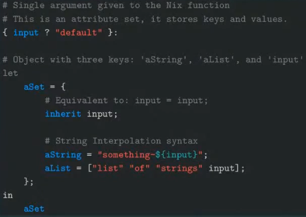
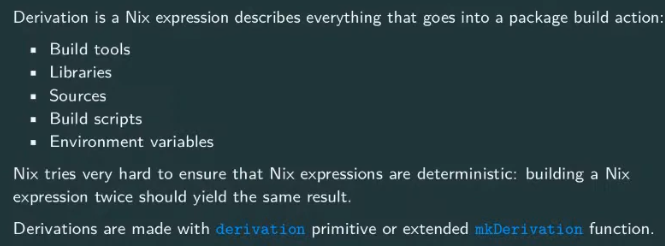
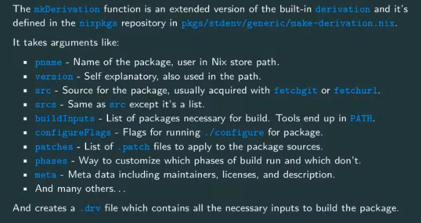
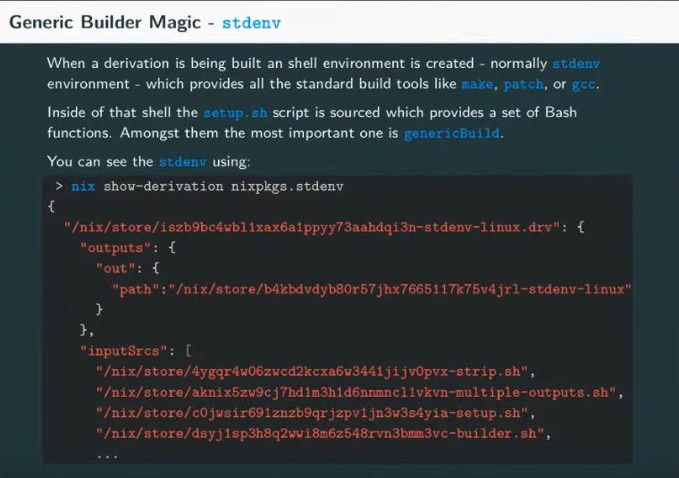

# Youtube video - Nix Fundamentals

https://www.youtube.com/watch?v=m4sv2M9jRLg

## Basics
`nix repl` to start an interactive nix language session.

Eigth basic types :

1. null
2. Bool: false
3. Integer: 2
4. Float: 0.4
5. String : "hello"
6. Lists : [12 14 "abc"]
7. Sets (these are more like dicts actually): {a="Foo";b=42}
8. Path : ./hello or <nixpkgs>


```
nix-repl> add = x: y: x + y   
nix-repl> add 2 3           
5
nix-repl> add "hello" "world"
"helloworld"

```

Main way to provide args in nix is using a set. Have named arguments and default values.


```
nix-repl> add = { x ? 2, y ? 2 }: x + y

nix-repl> add {}                        
4

nix-repl> add {x=5;} 
7

nix-repl> add {x=5;y=7;}
12

```

To ignore other named items in arg set:

```
add = { x ? 2, y ? 2, ... }: x + y
```

Every nix file is a Nix expression that can be a function or a value. But vast majority of nix files take form of a function that accepts a set.



To run nix code, can use for e.g. `nix-instantiate --eval -E '1+2'`

To run nix code from a file, can use `nix-instantiate --eval --strict --arg x 1 function.nix`

or this for string arg - 
`nix-instantiate --eval --strict --argstr input whatever ./nix_language/function.nix`

Can use `--json` flag to get generic output

nix-build is essentially a wrapper around nix-instantiate (to translate a high-level Nix expression to a low-level store derivation, including producing .drv files in nix store) and nix-store --realise (to build the store derivation).

```
{ input? "default" }:
let
    aString = "something-${input}";
    aList = [1 2 3 input];
in {
    aString=aString;
    aList=aList;
}
```

is equivalent to :

```
{ input? "default" }:
let
    aString = "something-${input}";
    aList = [1 2 3 input];
in {
    inherit aString aList;
}
```

## Importing files

Simple way - 
```
ret_val = import ./other_file.nix {inherit inputArg1;};
```

In order to avoid duplicating input args, can use newScope

```
pkgs ? import <nixpkgs> {}
callPackage = pkgs.newScope {inherit inputArg1;}
ret_val = callPackage ./other_file.nix {};
```

callPackage will automatically pick out the items in the set that are taken as input for that particular package.

## Derivation

Specifies everything needed to build a package



mkDerivation is a wrapper around derivation.



Can build using `nix-build hello_world_derivation.nix --no-out-link`

This will produce a .drv file and also nix-build it and produce the hello package.

### Stdenv

When a derivation is being built, an shell environment is created - normally `stdenv` environment which provides all the standard tools like `make`, `gcc` etc.



In setup.sh script, the genericBuild function is defined which does the unpackPhase, patchPhase, configurePhase, buildPhase, checkPhase, installPhase, fixupPhase, installCheckPhase, distPhase


## Nix Shells

`nix-shell --attr ripgrep '<nixpkgs>'`

`nix-shell ./hello_world_derivation.nix`

The `$stdenv` variables inside the nix-shell contains the `setup.sh` script initialized for this specific build.

Making a custom shell. `pkgs.mkShell` derivation which is not meant to be built but only meant to be used with nix-shell.

