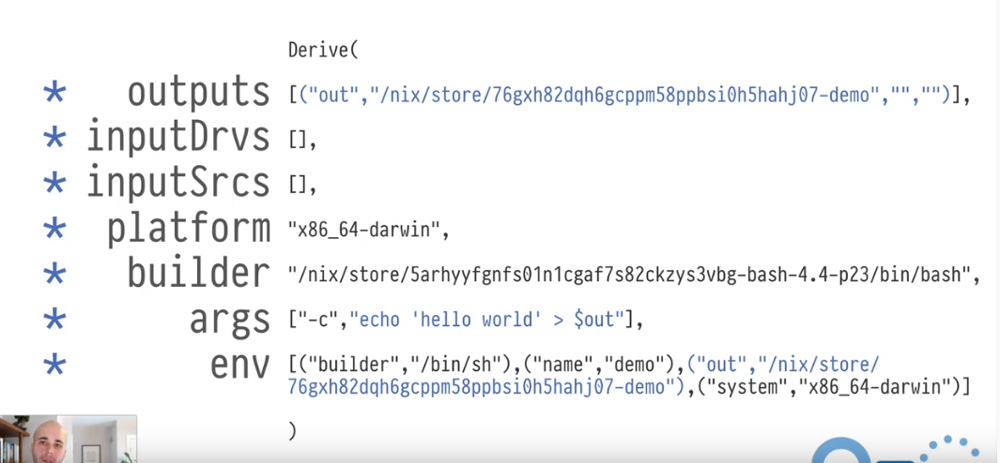
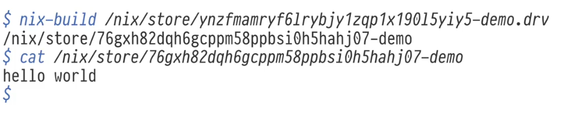
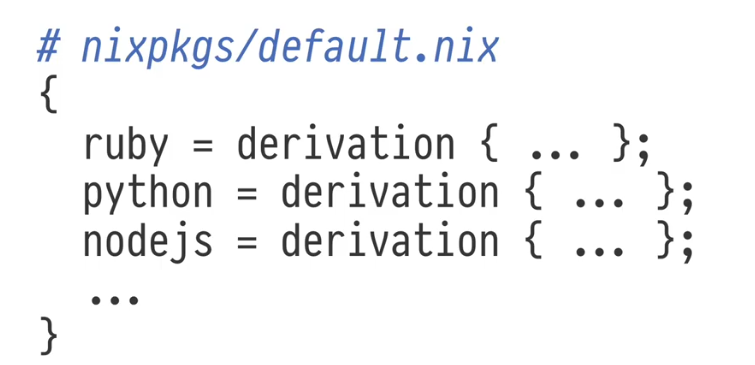

# Youtube video - Nix: What Even is it Though

https://www.youtube.com/watch?v=6iVXaqUfHi4

 - Software is a graph of dependencies
 - Typically this graph is implicit
 - Nix makes it explicit

4 major concepts

1. Store
2. Derivation
3. Sandbox
4. Language

## Nix Store

- `/nix/store` - is a graph
- `/nix/store/*` - immutable (contents wont change) nodes
- If a node includes references to other nodes, that constitutes an edge.

- e.g. - `/nix/store/xcdrs258vkh8kncw19bw8bmdlnafqkys-ruby-2.6.5`. Here
ruby-2.6.5 is the name of the node and
xcdr.... is "basically" hash of its contents

- The contents cant be modified after the directory is created.

Nix store is a graph database. Can be queried.

```
nix-store --query --references /nix/store/66fbv9mmx1j4hrn9y06kcp73c3yb196r-python3-3.8.9/
```

This will list dependencies of the "runtime" package python3-3.8.9 

To list the "build" dependencies of this package query the drv (derivation) file

```
nix-store --query --references /nix/store/qps9k35634y3f02msnyp5csqha6rmm82-python3-3.8.9.drv
```

## Derivation

- Special entries in the nix store.
- describe instructions to build other entries in the nix store
- `.drv` files in the nix store
- Also have a hash in the node name which refers to the hash of the contents of the `.drv`
- Every direct dependency is mentioned in the `.drv` so changing any single dependency will change the hash.
- contains the output path(s) which would be constructed in nix store if the derivation was built
- everything in the nix store is built using a derivation (except for the `.drv` derviations themselves)
- the hash of the constructed package is "basically" just a hash of the hash of `.drv`
- If hash of any of the dependency changes, hash of the package will change and also of other packages which depend on the current package.

Derivation definition :

- outputs : what nodes can this derivation build?
- inputDrvs : other derivations that must be built before this one
- inputSrcs : nodes already in nix store on which this build depends
- platform : macOS, linux etc.
- builder: program to run to do the build
- args: to pass to the builder
- env: to set before calling builder

Very very basic example:



this only creates a `/nix/store/...-demo` file with contents "hello world" when the nix-build command is used on this derivation



## Sandbox

- Only things mentioned in the derivation are available during build.
- Implementation of sandboxing varies by platform
- There is no thing as implicit dependency in nix
- You can literally a copy a nix store closure from one machine to other (as long as the platform is same) and it will run the same

## Nix Language

 - lazy evaluation
 - free of side effects (no networking, IO, file writing, use input etc., doesnt actually do anything)
 - except ofcourse creating and writing .drv files and running builder script (this is handled by the derivation function and nix build command)
 - derivation function returns similar set to the input but also adds 2 additional fields drvPath and outPath with correct hashed paths in /nix/store

# nixpkgs

Global default package repository

nixpkgs is just one long nix expression, one big attribute set, which has all the derivations (They are only evaluated if you use the entry from the set)



