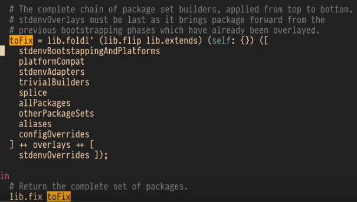

# Demystifying nixpkgs

https://www.youtube.com/watch?v=oWJaTb5uoT0

## Part 1

`<nixpkgs>` refers to `$NIX_PATH/nixpkgs/default.nix` and in my case this is `$NIX_PATH=/home/ankurs4/.nix-defexpr/channels`

It is simply a big attribute set with keys being name of the package and the value being the derivation.

derivation is the only function in nix language which has a sideffect (writes a .drv file).

## Part 2

Looking into `nixpkgs/default.nix` we see that it imports `.pkgs/top-level/impure.nix`.
In there we are importing `pkgs/top-level/default.nix`. 
In there we are importing `allPackages` from `./stage.nix`



The `toFix` is essentially a concatentation of all these constituents you see above. `allPackages` is where most of this comes from. `overlays` is local private nix packages.

If we go further into `allPackages`, we see it is importing `all-packages.nix` and there we hit the jackpot. We can ctrl+f for package we are interested in and find its relevant derivation.

## Part 3 - Standarrd library

The standard library : builtins namespace (https://nixos.org/manual/nix/unstable/expressions/builtins.html)

There is a lib folder in nixpkgs with additional functions. So if you import `<nixpkgs>`, you can use them as `pkgs.lib.singleton` for example

## Part 4 - Channels and NIX_PATH

In `~/.nix-channels` , the channels are specifed. For me its currently :

```
https://nixos.org/channels/nixpkgs-unstable nixpkgs
```

So when we `import <nixpkgs>` or `nix-env -i -A nixpkgs.ripgrep`, the nixpkgs is refering to this channel.

Also, in `~/.nix-defexpr/nixpkgs` the directory nixpkgs refers to this channel.

We can add a new entry in `~/.nix-channels`, for example :

```
https://nixos.org/channels/nixpkgs-21.05-darwin nixpkgs-21.05-darwin
```

and run `nix-channel --update` and we should see new directory `~/.nix-defexpr/nixpkgs-21.05-darwin`

In order to upgrade packages also (if they are updated in the new updated channel) - can run `nix-env -iA nixpkgs.<pkgname>` again individually or upgrade all pkgs by running `nix-env -u '*'`

Changing the channel in a nix derivation and rebuilding it would fetch and build new entries in nix store for its dependencies.

To get fully reproducebile builds, its recommended to not use channels like this anymore.
Instead just specify the exact sha of the nixpkgs like this :

```nix
{ pkgs ? import (fetchTarball "https://github.com/NixOS/nixpkgs/archive/e85975942742a3728226ac22a3415f2355bfc897.tar.gz") {} }
```
